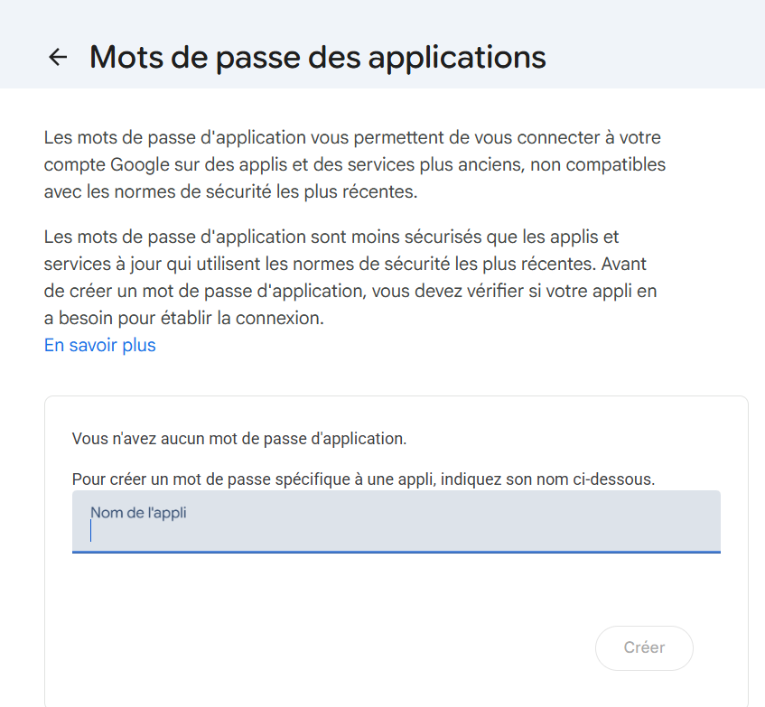
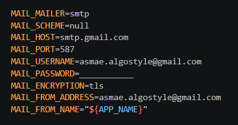
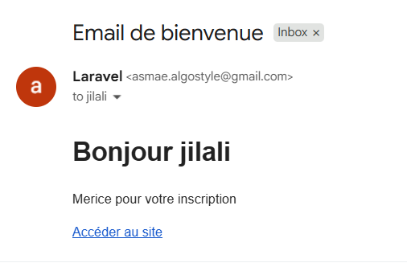
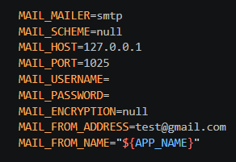
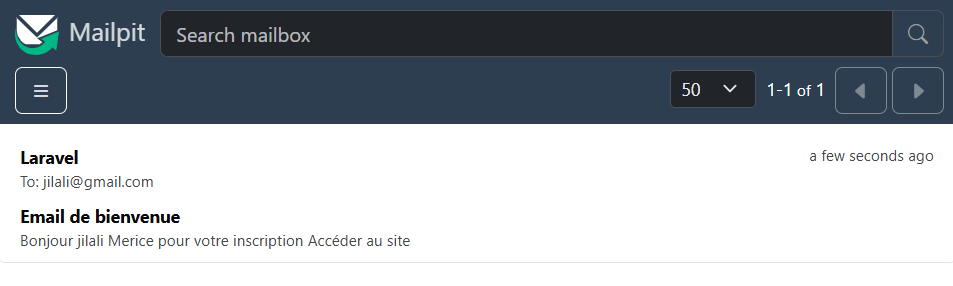
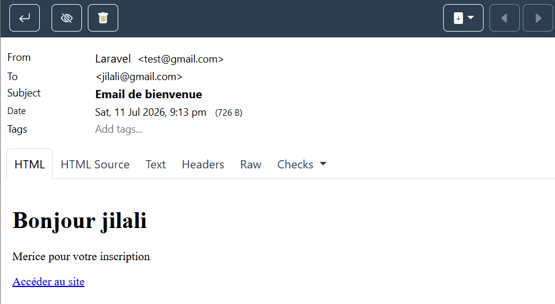

Générer une classe Mail qui permet de construire et d'envoyer un e-mail dans Laravel.
```
php artisan make:mail  WelcomeEmail
```

### Générer les identifiants SMTP Gmail
- Allez sur votre compte gmail
- Cliquez sur "gérer votre compte"
- Cherchez "Mot de passe de l'application"




- Entrez un nom et puis copiez le mot de passe généré






### Tester l’envoi des emails avec Mailpit 
- lancer mailpit
- Accéder à http://localhost:8025/ 



